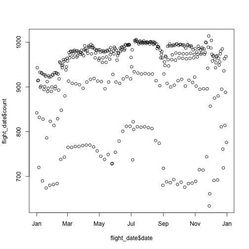

<style>
.small-code pre code {
  font-size: 1.2em;
}
</style>

Thinking fast with dplyr
========================================================
author: Freddie Sanchez, Galen Long
date: 2016-04-01

Resources
========================================================

Dplyr cheat sheet: https://www.rstudio.com/wp-content/uploads/2015/02/data-wrangling-cheatsheet.pdf

Workshop data
========================================================
class: small-code


```r
# install.packages("nycflights13")
library(nycflights13) # flights, airports, airlines, planes, weather
flights[1:3,1:8]
```

```
  year month day dep_time dep_delay arr_time arr_delay carrier
1 2013     1   1      517         2      830        11      UA
2 2013     1   1      533         4      850        20      UA
3 2013     1   1      542         2      923        33      AA
```

```r
names(flights)
```

```
 [1] "year"      "month"     "day"       "dep_time"  "dep_delay"
 [6] "arr_time"  "arr_delay" "carrier"   "tailnum"   "flight"   
[11] "origin"    "dest"      "air_time"  "distance"  "hour"     
[16] "minute"   
```

```r
nrow(flights)
```

```
[1] 336776
```

Generate questions
========================================================

Think of 10 *specific*, *testable* questions you have about the Ticketmaster data.

Examples for the flights data:

- Which planes fly the most?
- Do some days of the week have more flights than others?
- Do some carriers have more delays than others?
- Do longer flights tend to have more delays?

Organize questions
========================================================

Do some questions seem to be related to each other? Try and group them, and sort them in order of fruitfulness/ease of exploration.

Examples for the flights data:

1. Which planes fly the most?
2. How do the number of flights change over time?
3. Which variables have relationships with delays?

dplyr
========================================================
class: small-code


```r
# install.packages("dplyr")
library(dplyr)
```

Looking at data
========================================================
class: small-code

- Use `select()` to choose columns. Has equivalent `[]` syntax.
- Use `filter()` to select rows. Has equivalent `[]` syntax.
- Use `arrange()` to sort rows by column.


```r
# flights[,c('year', 'month', 'day', 'origin', 'dest')]
select(flights, year, month, day, origin, dest)

# flights[flights$year != 2013 & day == 1 | flight == 1613,]
filter(flights, year != 2013 & day == 1 | flight == 1613)

flights %>% # pipe data using %>%
  select(year, month, day, arr_delay, origin, dest) %>%
  arrange(-arr_delay)
```


Which planes fly the most?
========================================================
class: small-code

Tailnum uniquely identifies a plane.


```r
flights %>% 
  group_by(tailnum) %>% 
  summarize(num_flights = n(), 
            total_air_time = sum(air_time, na.rm = TRUE), 
            max_distance = max(distance)) %>% 
  arrange(-num_flights, -total_air_time)
```

```
Source: local data frame [4,044 x 4]

   tailnum num_flights total_air_time max_distance
     (chr)       (int)          (dbl)        (dbl)
1                 2512              0         4963
2   N725MQ         575          48921         1147
3   N722MQ         513          42664         1147
4   N723MQ         507          41496         1147
5   N711MQ         486          40709         1147
6   N713MQ         483          40031         1147
7   N258JB         427          35835         1598
8   N298JB         407          31020         1598
9   N353JB         404          33687         1598
10  N351JB         402          30840         1598
..     ...         ...            ...          ...
```

How do the number of flights change over time?
========================================================
class: small-code

You can utilize multiple functions to modify and aggregate variables.


```r
flight_date <- flights %>%
  mutate(date = paste(year, month, day, sep='-'),
         date = as.Date(date)) %>%
  group_by(date) %>%
  summarise(count = n())

plot(flight_date$date, flight_date$count)
```

 

How do the number of flights change over time?
========================================================
class: small-code

Regular R functions can piped as well.


```r
select(flights, month) %>%
  table() %>%
  barplot()
```

 

Do some carriers have more delays than others?
========================================================
class: small-code


```r
# TODO: investigate other variables
flights %>% 
  select(carrier, arr_delay) %>%
  group_by(carrier) %>%
  summarize(num_flights = n(),
            total_arr_delay = sum(arr_delay, na.rm = TRUE), 
            delay_per_flight = total_arr_delay / num_flights) %>% 
  arrange(delay_per_flight)
```


Do some carriers have more delays than others?
========================================================
class: small-code


```
Source: local data frame [16 x 4]

   carrier num_flights total_arr_delay delay_per_flight
     (chr)       (int)           (dbl)            (dbl)
1       AS         714           -7041       -9.8613445
2       HA         342           -2365       -6.9152047
3       AA       32729           11638        0.3555868
4       DL       48110           78366        1.6288921
5       VX        5162            9027        1.7487408
6       US       20536           42232        2.0564862
7       UA       58665          205589        3.5044575
8       9E       18460          127624        6.9135428
9       B6       54635          511194        9.3565297
10      WN       12275          116214        9.4675356
11      MQ       26397          269767       10.2196083
12      OO          32             346       10.8125000
13      YV         601            8463       14.0815308
14      EV       54173          807324       14.9027006
15      FL        3260           63868       19.5914110
16      F9         685           14928       21.7927007
```


Summary
========================================================
class: small-code


```r
select(flights, year, month, day, arr_delay, origin, dest)
filter(flights, year != 2013)
arrange(flights, -arr_delay)
group_by(flights, tailnum) %>% summarize(num_flights = n())
mutate(flights, 
       flight_date = as.Date(paste(year, month, day, sep = '-'))) 
  %>% select(year, month, day, flight_date)
# TODO add one for join
```


Thank you!
========================================================

Saturday workshops:<br />
Saturday 11 - 11:45 AM, *Visualizing data with ggplot2*, Deirdre<br />
Saturday 1:30 - 2:15 PM, *Handling dates with lubridate*, John

Github: https://github.com/massmutual/datafest2016<br />
Feedback: http://goo.gl/forms/rHnscEWjTL

Contact: gyoo, galenlong [at] massmutual [dot] com
